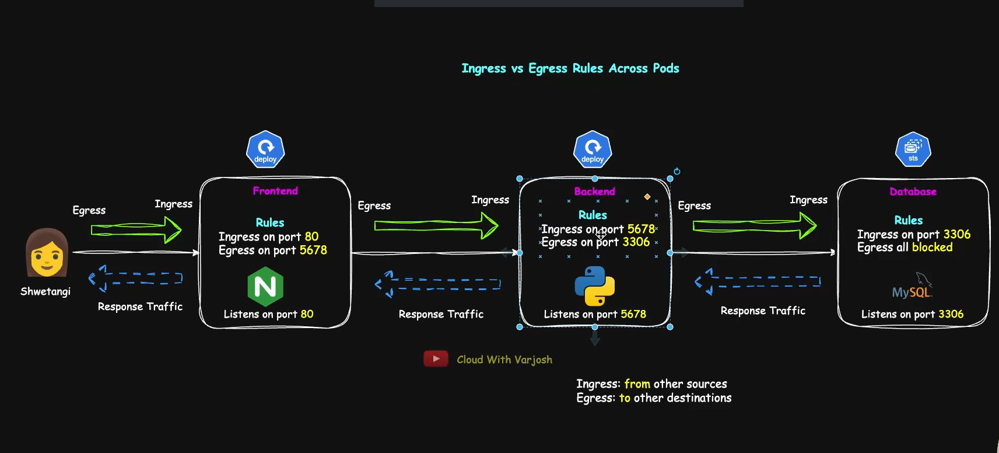

## Kubernetes Network Policies Explained

- $ kubectl config set-context --current --namespace=app1-ns

- After apply the the file till 04 enter any frontend pod
- $ kubectl exec -it frontend-deploy-id --bash
  - apt update && apt install telnet -y
  - telnet backend-svc 5678

- Now inside the backend pod we need to able to communicate
  - $ kubectl exec -it backend-pod-id -- bash
    - telnet db-svc 3307

---

- So we have 3 tier app Frontend Backend and Database tier

- Ingress = traffic coming into a component.
- Egress = traffic going out of a component.

- **Frontend**
  - In frontend we need to control 2 traffic Ingress and Egress
  - _Ingress_:
    - Users access the frontend (web app/UI).
    - The frontend must allow "ingress" traffic from users.
    - When an user want to access the frontend that Egress. So frontend should be able to enable Ingress for the user.
  - _Egress_:
    - The frontend calls backend APIs.
    - The frontend must allow egress traffic to the backend.

- **Backend**
  - In Backend we need to control 2 traffic Ingress and Egress
  - _Ingress_:
    - The backend receives API requests from the frontend.
    - The backend must allow ingress traffic from the frontend.
    - From frontend the backend api is called then we need to enable to open the Ingress from the frontend
  - _Egress_:
    - The backend connects to the database.
    - The backend must allow egress traffic to the database.
    - From backend we need to access the database. then we will enable the Egress for database.

- **Database**:
  - In Database we need to control 1 traffic that is just Ingress
  - _Ingress_:
    - The database receives connections from the backend.
    - The database must allow ingress traffic from the backend.
    - From the backend the database has been query then we need to enable Ingress for database and from the backend



- Yaml file for DBNetPolicy.yaml

```bash
apiVersion: networking.k8s.io/v1
kind: NetworkPolicy
metadata:
  name: db-policy
  namespace: app1-ns
spec:
  policyTypes:
    - Ingress
  podSelector:
    - matchLabels:
      app: app1
      role: db
  ingress:

    - from:             # Which pod are able to communicate with db pod
        - podSelector:
            - matchLabels:
              app: app1
              role: backend

      ports:            # Which pod are able to communicate with db pod
        - protocol: TCP
          port: 3306
```

- Yaml file for BackendNetPlo.yaml

```bash
apiVersion: networking.k8s.io/v1
kind: NetworkPolicy
metadata:
  name: backend-policy
  namespace: app1-ns
spec:
  policyTypes:
    - Ingress
    - Egress
  podSelector:
    matchLabels:
      app: app1
      role: backend
  Ingress:
    - from:
        - podSelector:
            matchLabels:
              app: app1
              role: frontend
      port:
        - protocol: TCP
          port: 5678

  egress:
    - to:
        - podSelector:
            matchlabels:
              app: app1
              role: db
      port:
        - protocol: TCP
          port: 3306
    - to:
        - namespaceSelector:
            matchLabels:
              kubernetes.io/metadata.name: kube-system
          podSelector:
            matchLabels:
              k8s-app: kube-dns
      ports:
        - protocol: UDP
          port: 53
        - protocol: TCP
          port: 53

```

- Yaml file for FrontendNetworkPolicy.yaml

```bash
apiVersion: networking.k8s.io/v1
kind: NetworkPolicy
metadata:
  name: db-policy
  namespace: app1-ns
spec:
  podSelector:
    matchLabels:
      app: app1
      role: frontend
  policyTypes:
    - Ingress
    - Egress
  ingress:
    - from:
        - ipBlock:
            cidr: 0.0.0.0/0
      ports:
        - protocol: TCP
          port: 80
  egress:
    - to:
        - podSelector:
            matchLabels:
              app: app1
              role: backend
          ports:
            - protocol: TCP
              port: 5678
    - to:
        - namespaceSelector:
            matchLabels:
              kubernetes.io/metadata.name: kube-system
          podSelector:
            matchLabels:
              k8s-app: kube-dns
      ports:
        - protocol: UDP
          port: 53
        - protocol: TCP
          port: 53

```
