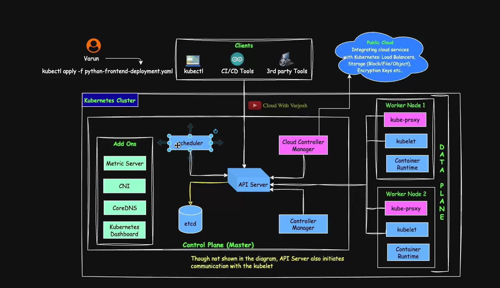

## Day 15: Manual Scheduling & Static Pods



- Kubernetes Components
- **Master Node**
  - Api
  - ETCD
  - Control manager
  - Scheduler
- **Worker Node**
  - Kubectl
  - kube-proxy

- **Scheduler Considerations**:
  - Resource Availability (CPU, memory)
  - Taints and tolerations (node restrictions).
  - Affinity and anti-affinity rules.

- **Why do we need manual Scheduling**
  - Troubleshooting & Debugging
  - Testing Node-Specific Workloads
  - Kubernetes Scheduler is Unavailable

- **What is manual scheduling**
  Manual scheduling means explicitly assigning a pod to a node using the nodeName field in the pod's YAML manifest. This completely bypasses the kubernetes scheduler.

```bash

$ kubectl config get-contexts
$ kubectl config set-context --current --namespace=default

```

- **What are Static Pods**
  - Static pods are created and manged by the kubelet on a node, not by the kubernetes API server.
  - Static pods are defines in /etc/kubernetes/minifests/

- **Nomenclature**:
  - Format : <static-po-name>-<node-hostname>
  - Example : nginx-static-pod-my-second-cluster-worker2
