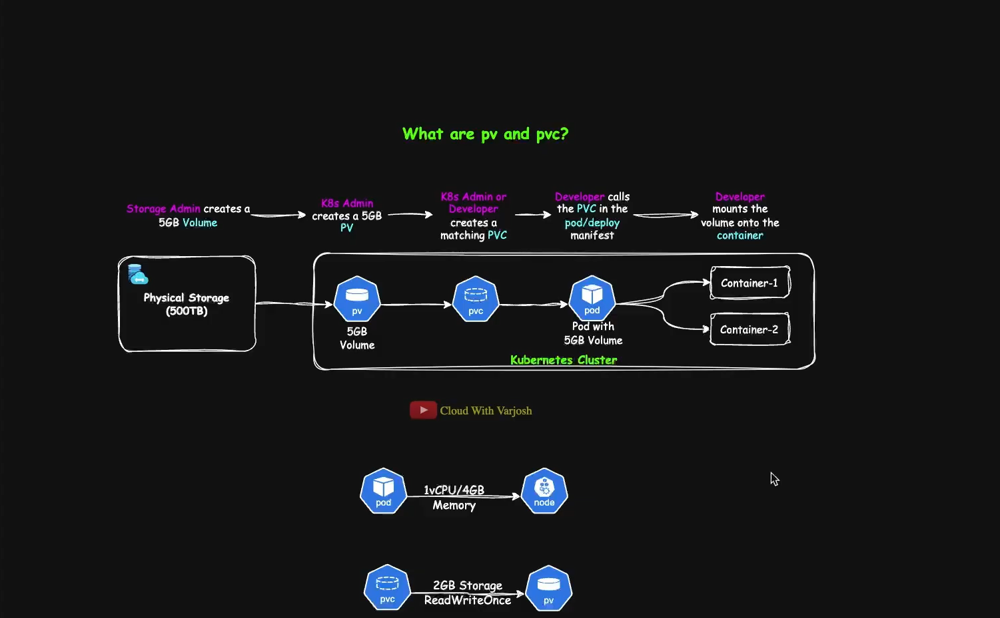
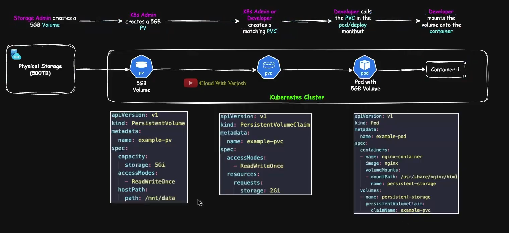

# Day 27: Kubernetes Volumes | Persistent Storage | PV, PVC, StorageClass, hostPath DEMO

- Persistent Storage
  - So anything that prevails irrespective of the lifetime of the pod is persistent storage. For example

- _Ephemeral Volume_ types have a lifetime linked to a specific Pod,
- _persistent volumes_ exist beyond the lifetime of any individual pod
- When a pod ceases to exist , kubernetes destroys ephemeral volume; however k8s doesn't destroy persistent volumes.
- _Persistent storage_ (or non-volatile storage) is any data storage device or system that retains data after power to the device is turned off. It ensures information survives system restarts, application shutdowns, or container termination, making it essential for databases and long-term data retention. Examples include hard drives, SSDs, and cloud storage volumes

- What are plugins, add-Ons, Third-Party Extensions: That enhance the capability of that system

- File system is accessible my multiple server or linux or node. Ex: USB Driver
- Block System: Block System is typically accessed by a single system. Ex: Laptop

- 

- PVC and PV Using Access Mode
- Storage Admin create a 5GB Volume -> K8s Admin Creates a 5GB PV -> K8s Admin or Developer creates a matching PVC -> Developer calls the PVC in the pod/deploy manifest -> Developer mounts the volume onto the container

- 

### From Physical Device

- _PVFile.yaml_

```bash
# cah
---
apiVersion: v1
kind: persistentVolume
metadata:
  name: example-pv
spec:
  capacity:
    storage: 5Gi
  accessModes:
    - ReadWriteOnce
  hostPaths:
    path: /mnt/data

---
apiVersion: v1
kind: persistentVolume
metadata:
  name: example-pv
spec:
  capacity:
    storage: 5Gi
  accessModes:
    - ReadWriteOnce
  hostPath:
    path: /mnt/data

```

- PVCFile.yaml

```bash
apiVersion: v1
kind: persistentVolumeClaim
metadata:
  name: example-pvc
spec:
  accessModes:
    - ReadWriteOnce
  resources:
    requests:
      storage: 2Gi

```

---

### In Kubernetes, a PVC chooses a PV based on matching rules

- Kubernetes automatically checks:
  - Storage size
  - Access mode
  - StorageClass
  - Availability

1. PersistentVolume (PV)

```bash
apiVersion: v1
kind: PersistentVolume

metadata:
  name: my-pv

spec:
  capacity:
    storage: 5Gi
  accessModes:
    - ReadWriteOnce
  persistentVolumeReclaimPolicy: Retain
  storageClassName: manual-storage
  hostPath:
    path: /mnt/data
```

2. persistentVolumeClaim(PVC)

```bash
apiVersion: v1
kind: PersistentVolumeClaim
metadata:
  name: my-pvc
spec:
  accessModes:
    - ReadWriteOnce
  resources:
    requests:
      storage: 5Gi
  storageClassName: manual-storage
  volumeName: my-pv
```

3. Pod Using the PVC

```bash
apiVersion: v1
kind: Pod
metadata:
  name: nginx-pod
spec:
  containers:
    - name: nginx
      image: nginx
      volumeMounts:
        - mountPath: /usr/share/nginx/html
          name: my-storage
  volumes:
    - name: my-storage
      persistentVolumeClaim:
        claimName: my-pvc
```
