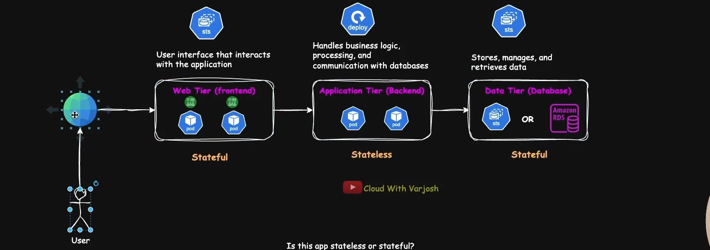
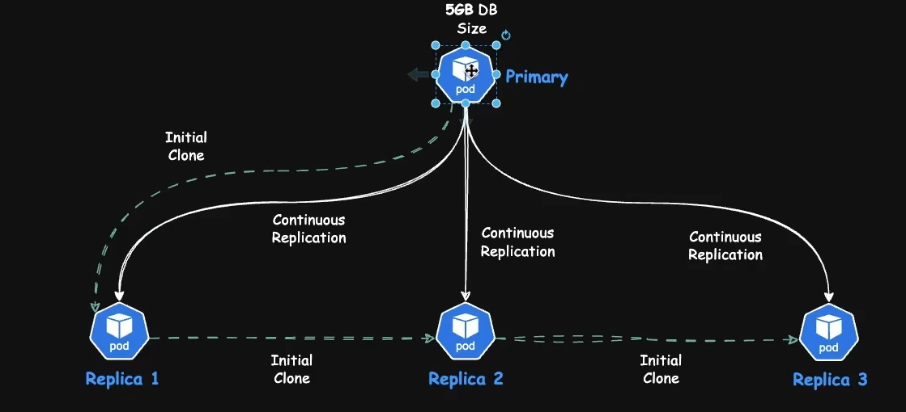

## StateFull vs StateLess

- A _StateFull_ app is code + data, tightly coupled. Its behavior depends on internal memory or persistent data it holds or stores.
- A _stateless_ app is just code. it can be stopped, restarted, or rescheduled without user disruption

### What it takes to run a Database?

One primary node (formerly called the master) : handles all writes Multiple replicas (read-only) : provide redundancy and help with read scaling.

## What it takes to run a Database?

- One primary node (formerly called the master) : handles all writes.
- Multiple replicas (read-only) : provide redundancy and help with read scaling

- There are 2 stages in setting up a replica:
  - **_Initial Cloning_** :
    - Copy the existing 5 GB of data to the replica.
    - Cascading replication / Chained Replication (One By One - Main-> Pod1 -> Pod2 -> Pod3)
  - **_Continuous Replication_** :
    - keep syncing future writes/modifications from the primary
    - Direct replication

- 

- A common architecture involves one primary (or master) node that handles both reads and writes, and multiple replica nodes that are read-only. Applications or services that need to perform write operations (inserts, updates, deletes) are directed to the primary.

- To reduce load on the primary and improve performance, read-heavy operations are often offloaded to replicas. This read-write separation helps scale the system more effectively, especially under high-concurrency workloads. This architecture is not just for performance - It's also key for high availability. If the primary node fails, one of the replicas can be promoted to primary, ensuring minimal downtime and continued service.

---

## What is that we want ?

- **_What we want_** ?
  - Stable & predictable pod naming
    - <StateFulSet-name>-<ordinal>
  - Stable Networking Identity (DNS). (CoreDNS aware)
  - pods start & terminate in the right order.
    - Start : mysql-0 -> mysql-1 -> mysql-2 -> mysql-3
    - Terminate : mysql-3 -> mysql-2 -> mysql-1 -> mysql-0
  - Persistent Volume Reattachment

- Databases like MySQL, postgreSQL require:
  - High IOPS and low latency
  - Stable volumes that aren't shared across multiple pods
  - Reliable disk-backed writes and transactional consistency. _(ACID = Associated with Isolation database)_ / _(Atomicity Consistency Isolation Durability)_
- Because of the above reasons:
  - Block storage is preferred with RWO or RWOP (Preferred)

### What are StateFulSets (sts)

- It is a k8is workload controller that is purpose-built for managing stateful applications, where pod identity, network stability, and storage persistence are critical.
- Key points about sts:
  - They provide:
    - Stable & Predictable pod naming
    - stable n/w identity (Stable DNS Name)
    - Start & Termination Order
    - Persistent Volume re-attachment
  - These properties make sts ideal for:
    - Relational databases : MYSQL, PostgreSQL
    - Distributed systems : Cassandra, Elasticsearch
    - Queues and coordination services : Kafka, Zookeeper
  - Replicated caches: Radis Cluster, MongoDB ReplicaSets

- *Nomenclature*:
	- Pod name (stable identity)
		- Syntax : <statefulset-name>-<ordinal-index>
		- Example : mysql-0
	- DNS Name (Stable network Identity)
		- Syntax: <pod-name>.<headless-service-name>.<namespace>.svc.cluster.local
		- Example : mysql-0.mysql-ha.svc.cluster.local