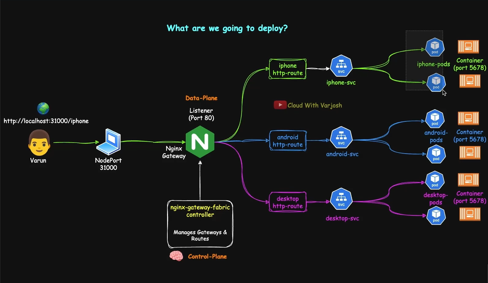

### GATEWAY API

- _What's missing in Ingress_
  - Native multi-tenancy or namespace-level route isolation.
  - Support for TCP, UDP, or gRPC routing.
  - First-class features like canary (traffic splitting on weighted routing), ssl redirect, rewrites, rate limiting.
  - Portability : Annotations are vender-specific and not spec-validated

- _What is Gateway API?_
  - Gateway API = Next-gen Ingress with multi-protocol support, role separation, and portable traffic management.
  - Native multi-tenancy or namespace-level route isolation.
  - Support for TCP, UDP, or gRPC routing. HTTP
  - First-class features like canary (traffic splitting or weighted routing), ssl redirect, rewrites, rate limiting.
  - Not a build-in resource; enabled via CRDs and requires a compatible controller to function.
  - Developed K8S SIG

## Gateway API has three stable API KINDs

- **_GatewayClass ( Infrastructure Provider)_**
  - Logical template for Gateway configuration and features.
  - Binds to a specific Gateway controller implementation.
  - Referenced by Gateway; does not create runtime resources.
  - Holds provider-specific parameters and default policy
  - Typically managed by infra/platform team for consistency

```bash
apiVersion: gateway.networking.k8s.io/v1
kind: GatewayClass
metadata:
  name: nginx
spec:
  controllerName: gateway.nginx.org/nginx/gateway-controller
  parametersRef:
    group: gateway.nginx.org
    kind: NginxProxy
    name: ngf-proxy-config
    namespace: ngf-gatewayapi-ns

```

- **Gateway (Cluster Operators)**
  - Provisions the load balancer defined by its GatewayClass
  - Configures Listeners (ports, protocols, hostname)
  - Links one or more Routes to backend Services
  - References a single GatewayClass For Controller binding
  - Typically provisioned/managed by cluster operators

```bash
apiVersion: gateway.networking.k8s.io/v1
kind: Gateway
metadata:
  name: gateway
  namespace: ngf-proxy-config
spec:
  gatewayClassName: nginx
  listeners:
    - name: http
      port: 80
      protocol: HTTP
      allowedRoutes:
        namespaces:
          from: ALL

```

- **Route Objects (Application Developers)**
  - Define routing rules for Gateways
  - Support HTTP, TCP, UDP, GRPC
  - Forward traffic to backend kubernetes Services
  - Managed by application developers or service owners

```bash
apiVersion: gateway.networking.k8s.io/v1
kind: HTTPRoute
metadata:
  name: iphone-routes
  namespace: app1-ns
spec:
  parentRefs:
    - name: gateway
      namespace: ngf-gatewayapi-ns
      sectionName: http
  rules:
    - matches:
        - path:
          type: PathPrefix
          value: /iphone
      backendRefs:
        - name: iphone-svc
          port: 80

```

---

- **_Demo : Gateway API with NGINX Gateway Fabric_**
  - Deploy NGF in a kind cluster using HELM
  - Expose the NGF Gateway via NodePort for Local access.
  - Create a Gateway, Listeners, and HTTPRoutes for different applications.
  - Route traffic to multiple backends (/iphone, /android, /) using Gateway API



---

# Demo: Gateway API with NGINX Gateway Fabric

## Pre-requisites

- Before we start, We need to installed some package:
  - KIND
  - KUBECTL
  - HELM
    - For windows ->

```bash

# If we have chaco then we can do
choco install kubernetes-helm

```

## Step 1: Configure KIND Cluster

- 1.1 First Delete All Cluster

```bash
# To get all the Cluster
$ kind get cluster

# Delete The Cluster
$ kind delete cluster --name=<cluster-name>
```

- 1.2 KIND cluster config (00-kind-cluster.yaml)

```bash
kind: Cluster
apiVersion: kind.x-k8s.io/v1alpha4
nodes:
  - role: control-plane
    image: kindest/node:v1.34.3@sha256:08497ee19eace7b4b5348db5c6a1591d7752b164530a36f855cb0f2bdcbadd48
    extraPortMappings:
      - containerPort: 31000
        hostPort: 31000
  - role: worker
    image: kindest/node:v1.34.3@sha256:08497ee19eace7b4b5348db5c6a1591d7752b164530a36f855cb0f2bdcbadd48
  - role: worker
    image: kindest/node:v1.34.3@sha256:08497ee19eace7b4b5348db5c6a1591d7752b164530a36f855cb0f2bdcbadd48
```

-> This mapping allows your local machine (localhost:31000) to directly hit the Kubernetes NodePort service running inside the KIND control-plane container.

- 1.3 Create the Cluster

```bash

# Create the Cluster
$ kind create cluster --name=gateway-api --config=00-kind-cluster.yaml

```

## Step 2: Install Gateway API CRDs

Install the latest version of the Gateway API CRDs

```bash

# This ensures that the CRDs and controller remain version-aligned.
$ kubectl kustomize "https://github.com/nginx/nginx-gateway-fabric/config/crd/gateway-api/standard?ref=v2.6.3" | kubectl apply -f -

# /
# or

kubectl apply -f https://github.com/kubernetes-sigs/gateway-api/releases/download/v1.4.0/standard-install.yaml
```

- It will install
  - **GatewayClass** – Defines a class of gateways (cluster-wide template for data planes)
  - **Gateway** – An instance of a GatewayClass (control plane and listener configuration)
  - **HTTPRoute** – Rules that route HTTP traffic to backend services
  - **GRPCRoute** – Similar to HTTPRoute, but for gRPC traffic
  - **ReferenceGrant** – Allows controlled cross-namespace references
- Verify installation

```bash

  $ kubectl api-resources | grep gateway
```

## Step 3: Install the NGINX Gateway Fabric Controller

- We’ll run NGF in its own namespace and expose it via NodePort 31000.

```bash
helm install ngf oci://ghcr.io/nginx/charts/nginx-gateway-fabric \
  --create-namespace -n ngf-gatewayapi-ns \
  --set nginx.service.type=NodePort \
  --set-json 'nginx.service.nodePorts=[{"port":31000,"listenerPort":80}]'
```

Verify:

```bash
kubectl get deploy -n ngf-gatewayapi-ns
```

GatewayClass auto-created:

```bash
kubectl get gatewayclasses.gateway.networking.k8s.io -o wide
```
